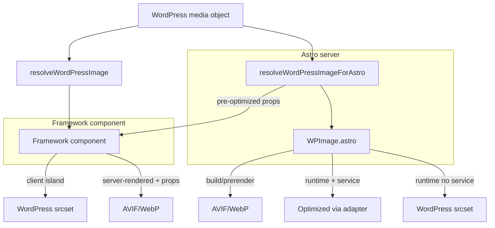

import { Tabs, TabItem } from '@astrojs/starlight/components';

## How it works

The image helpers choose the best rendering strategy based on context:

| Context | Default behavior |
|---|---|
| **Build / prerender** | Optimize with Astro's `<picture>` (AVIF/WebP) |
| **Runtime with image service** | Optimize via adapter (Cloudflare, Vercel, Sharp) |
| **Runtime without image service** | WordPress native `srcset` |
| **UI frameworks (React, Vue, Svelte)** | WordPress `srcset` in client islands; optimized props when server-rendered |

### Optimization modes

All components and helpers accept an `optimize` prop:

| Mode | Behavior |
|---|---|
| `auto` (default) | Optimize at build/prerender. At runtime, use WordPress srcset unless a real image service is configured. |
| `always` / `true` | Force Astro optimization. May fail at runtime without image service. |
| `never` / `false` | Always use WordPress srcset. No Astro optimization. |

### Required: allow WordPress domain

Add your WordPress host to `astro.config.mjs` so Astro can optimize remote images:

```js title="astro.config.mjs"
export default defineConfig({
  image: {
    domains: ['cms.example.com'],
  },
});
```

## Usage

<Tabs>
  <TabItem label="Astro component">

### WPImage

The easiest way to render WordPress images in `.astro` files:

```astro
---
import WPImage from 'wp-astrojs-integration/components/WPImage.astro';

const { media } = Astro.props; // WordPress media object
---

<WPImage media={media} size="large" />
```

**Props:**

| Prop | Type | Default | Description |
|---|---|---|---|
| `media` | `WordPressMedia` | required | WordPress media object from loader or API |
| `size` | `string` | `'full'` | WordPress image size: `thumbnail`, `medium`, `large`, `full` |
| `optimize` | `'auto' \| 'always' \| 'never' \| boolean` | `'auto'` | Optimization strategy |
| `formats` | `string[]` | `['avif', 'webp']` | Source formats for `<picture>` |
| `alt` | `string` | media alt text | Accessible alt text |
| `loading` | `'lazy' \| 'eager'` | `'lazy'` | Image loading strategy |
| `class` | `string` | `''` | CSS class |

```astro
---
// Auto: optimize at build, use WordPress srcset at runtime without image service
const image1 = <WPImage media={media} />;

// Always optimize
const image2 = <WPImage media={media} optimize="always" />;

// Never optimize - always use WordPress srcset
const image3 = <WPImage media={media} optimize="never" />;
---
```

  </TabItem>
  <TabItem label="UI frameworks (React, Vue, Svelte)">

### Client islands

In client-side framework components, use `resolveWordPressImage()` for WordPress-native `src` and `srcset`:

```tsx title="src/components/PostImage.tsx"
import { resolveWordPressImage } from 'wp-astrojs-integration/components/image';

export function PostImage({ media }) {
  const image = resolveWordPressImage(media, { size: 'large' });

  return (
    
  );
}
```

```astro title="src/pages/post/[slug].astro"
---
import PostImage from '../../components/PostImage.jsx';
---

<PostImage media={featuredMedia} client:load />
```

This returns WordPress `src` and `srcset` — no Astro optimization. The component works in client islands because it has no Astro server dependencies.

### Server-rendered with optimized props

To get Astro-optimized images (AVIF/WebP) in framework components, pre-process on the Astro server and pass serializable props:

```astro title="src/pages/post/[slug].astro"
---
import { resolveWordPressImageForAstro } from 'wp-astrojs-integration/components/astro-image';
import PostImage from '../../components/PostImage.jsx';

const imageProps = await resolveWordPressImageForAstro(Astro, featuredMedia, {
  size: 'large',
  formats: ['avif', 'webp'],
});
---

<PostImage image={imageProps} />
```

```tsx title="src/components/PostImage.tsx"
export function PostImage({ image }) {
  if (image.kind === 'picture') {
    return (
      <picture>
        {image.sources.map((source) => (
          <source
            key={source.type}
            type={source.type}
            srcSet={source.srcSet}
            sizes={source.sizes}
          />
        ))}
        
      </picture>
    );
  }

  // Fallback to plain img
  return ;
}
```

  </TabItem>
</Tabs>

## Adapter-specific configs

### Cloudflare

```js title="astro.config.mjs"
import cloudflare from '@astrojs/cloudflare';

export default defineConfig({
  adapter: cloudflare({
    imageService: {
      build: 'compile',      // Optimize at build
      runtime: 'passthrough', // WordPress srcset at runtime
    },
  }),
});
```

For Cloudflare runtime optimization:

```js title="astro.config.mjs"
export default defineConfig({
  adapter: cloudflare({
    imageService: {
      build: 'compile',
      runtime: 'cloudflare-binding',
    },
  }),
});
```

### Vercel

```js title="astro.config.mjs"
import vercel from '@astrojs/vercel';

export default defineConfig({
  adapter: vercel({
    imageService: true, // Uses Vercel Edge Network
  }),
});
```

### Node (default)

No adapter config needed. Sharp optimizes at build and runtime.

## Data flow


